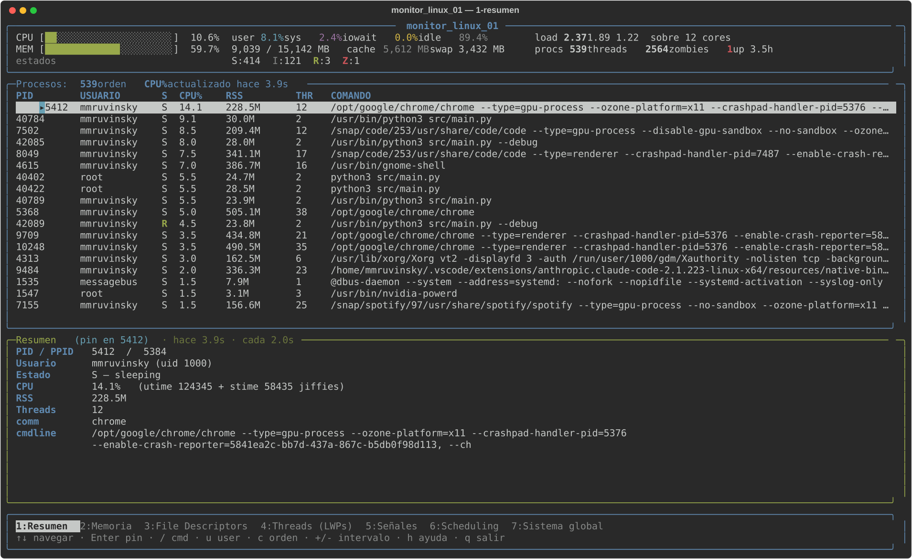
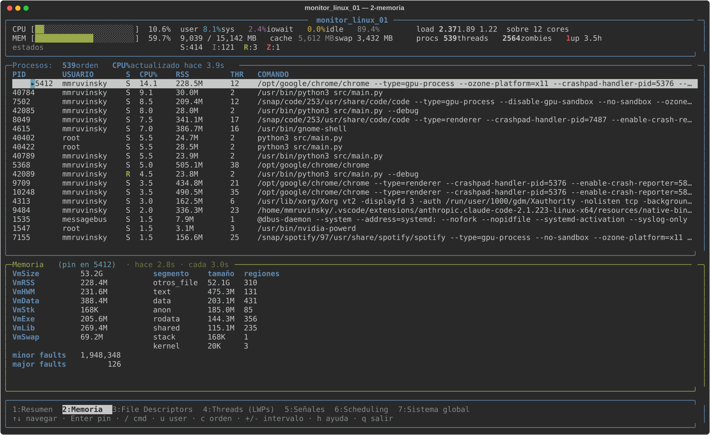
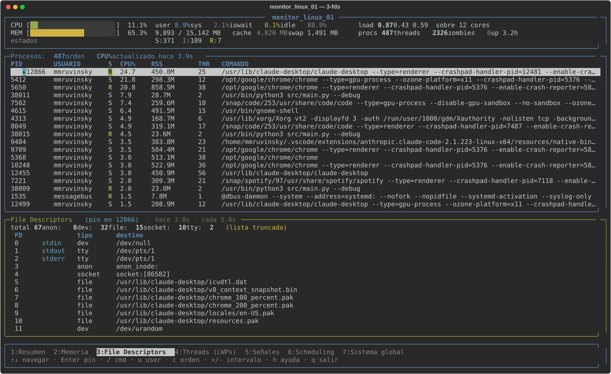
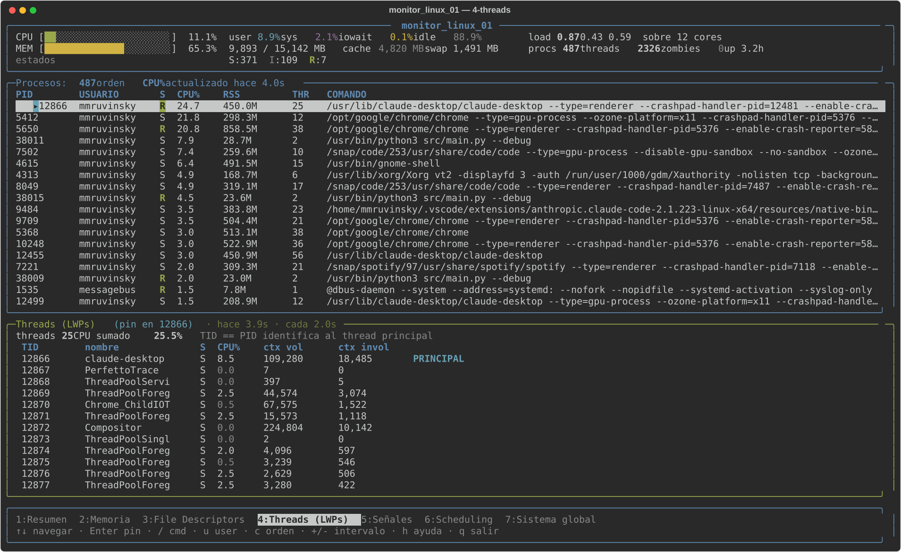
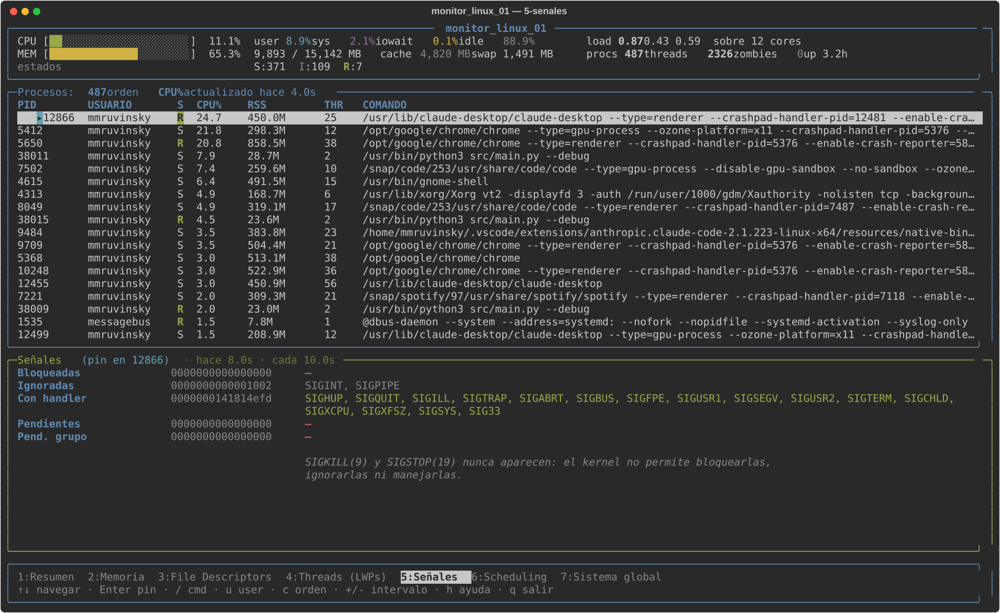
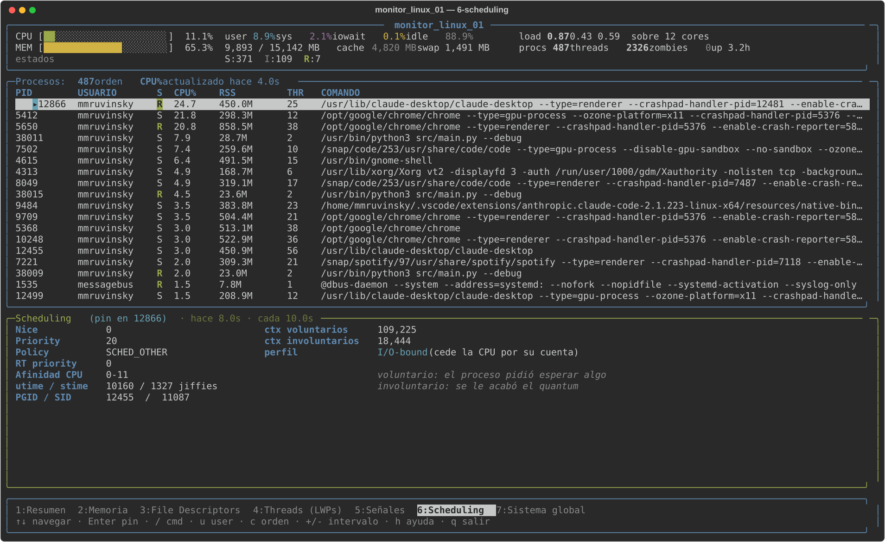
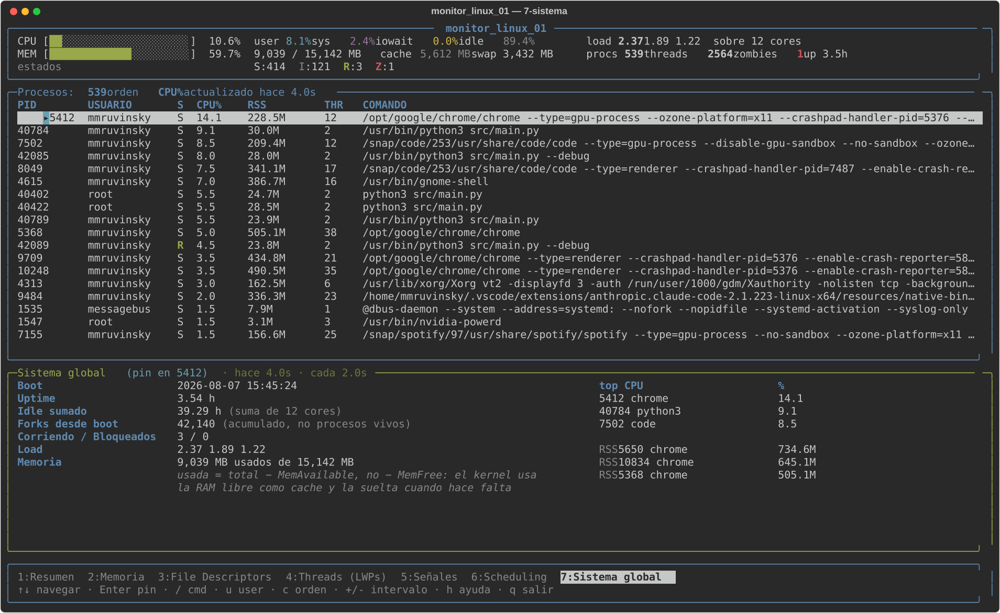
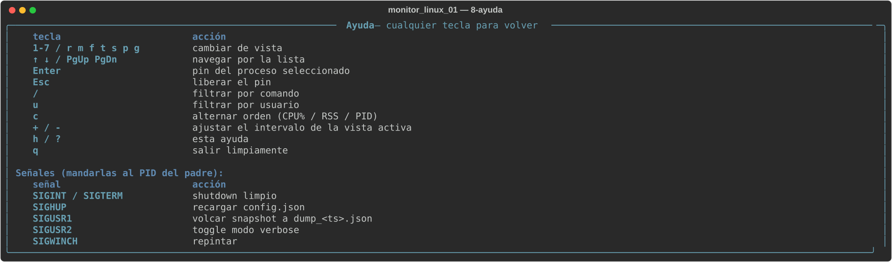

# Monitor de Procesos y Threads

**Trabajo Práctico Nº 1 — Computación II — Universidad de Mendoza — 2026**

Monitor del sistema en tiempo real para Linux, con arquitectura multiproceso.
Toda la información se extrae leyendo `/proc` directamente (sin `psutil` ni
equivalentes).

---

## 1. Descripción general

Monitor de procesos y threads del sistema, parecido a `htop` pero con énfasis en
la **anatomía interna** de cada proceso: sus segmentos de memoria, sus file
descriptors, sus threads, sus máscaras de señales y su configuración de
scheduling.

Toda la información sale de leer `/proc` a mano. No se usa `psutil` ni ninguna
biblioteca que abstraiga el acceso al kernel, ni se parsea la salida de `ps` o
`top`.

Corre como **12 procesos en paralelo**, cada uno con su propio ritmo:

| Proceso | Cantidad | Qué hace |
|---|---|---|
| main (padre) | 1 | señales, ciclo de vida, shutdown |
| recolector | 1 | lista los PIDs vivos cada 1 s |
| analizadores | 7 | uno por dimensión, con intervalo propio |
| agregador | 1 | calcula deltas y derivados |
| display | 1 | la TUI (`rich`) |
| servidor del `Manager` | 1 | lo levanta `multiprocessing`, no nosotros |

### Las 7 vistas

| Tecla | Vista | Default | Qué muestra |
|---|---|---|---|
| `1` / `r` | Resumen | 2 s | estado, CPU%, RSS, threads, comando |
| `2` / `m` | Memoria | 3 s | Vm*, page faults, segmentos de `maps` |
| `3` / `f` | File descriptors | 5 s | FDs abiertos y su destino real |
| `4` / `t` | Threads | 2 s | LWPs con CPU% y context switches |
| `5` / `s` | Señales | 10 s | máscaras decodificadas a nombres |
| `6` / `p` | Scheduling | 10 s | nice, policy, afinidad, ctx switches |
| `7` / `g` | Sistema | 2 s | CPU global, memoria, load, totales |

### Teclas

```
1-7 / r m f t s p g   cambiar de vista
↑ ↓ / PgUp PgDn       navegar por la lista
Enter                 fijar (pin) el proceso seleccionado
Esc                   liberar el pin
/                     filtrar por comando
u                     filtrar por usuario
c                     alternar orden (CPU% / RSS / PID)
+ / -                 ajustar el intervalo de la vista activa
h / ?                 ayuda
q                     salir limpiamente
```

### Señales

| Señal | Acción |
|---|---|
| `SIGINT` / `SIGTERM` | shutdown ordenado de los 10 hijos |
| `SIGHUP` | recarga `config.json` en caliente |
| `SIGUSR1` | vuelca el snapshot a `dump_<timestamp>.json` |
| `SIGUSR2` | toggle de modo verbose: sube los topes de FDs y threads por proceso |
| `SIGWINCH` | repintado (la TUI ya se adapta sola) |

---

## 2. Diagrama de arquitectura

```
                    ┌─────────────────────────┐
                    │  MAIN (padre)           │
                    │  handlers de señales    │
                    │  self-pipe              │
                    └───────────┬─────────────┘
                                │ fork()
     ┌──────────────┬───────────┼───────────────┬──────────────┐
     │              │           │               │              │
┌────▼─────┐  ┌─────▼──────┐   ...        ┌────▼─────┐  ┌─────▼────┐
│Recolector│  │Analizador 1│  (×7)        │Agregador │  │ Display  │
│ lista    │  │  resumen   │              │          │  │  TUI     │
│ /proc    │  │            │              │          │  │          │
└────┬─────┘  └──┬──────▲──┘              └────▲──┬──┘  └──┬────▲──┘
     │           │      │                      │  │        │    │
     │ escribe   │      │ lee lista            │  │        │    │
     │ "pids"    │      │ de pids              │  │        │    │
     │           │  [Queue]                    │  │ escribe│    │ lee
     │           └──────┼──────────────────────┘  │ dimens.│    │ snapshot
     │                  │   resultados crudos     │        │    │
     │                  │                         │        │    │
     └──────────────────▼─────────────────────────▼────────▼────┘
              ┌──────────────────────────────────────────┐
              │      Manager().dict()  (proceso propio)  │
              │  "pids", "resumen", "memoria", "fds",    │
              │  "threads", "senales", "scheduling",     │
              │  "sistema"     + timestamp cada uno      │
              └──────────────────────────────────────────┘

        Display --[Value(double) ×7]--> Analizadores   (intervalos, +/-)
```

### Procesos del sistema

| Proceso | Cantidad | Responsabilidad |
|---|---|---|
| Main (padre) | 1 | Lanza los hijos, maneja señales, orquesta el shutdown |
| Recolector | 1 | Lista los PIDs vivos en `/proc` y los publica como estado |
| Analizadores | 7 | Cada uno extrae una dimensión, con su propio intervalo |
| Agregador | 1 | Consume las muestras crudas, calcula derivados, escribe el snapshot |
| Display | 1 | Renderiza la vista activa (TUI) y lee el teclado |
| Servidor del `Manager` | 1 | Creado implícitamente por `multiprocessing.Manager()` |

---

## 3. Decisiones de diseño

### 3.1 Por qué multiproceso y no multithread

La intuición inicial fue que leer `/proc` es una carga **I/O-bound** y que por
eso el GIL sería un problema. Ese razonamiento es incorrecto en las dos mitades,
y vale la pena dejarlo escrito porque la conclusión correcta llega por otro
camino.

**Primero:** si la carga fuera realmente I/O-bound, los *threads* funcionarían
bien. Un thread de Python **suelta el GIL** mientras espera en una syscall
bloqueante, así que varios threads pueden esperar I/O simultáneamente sin
estorbarse. "Es I/O-bound" es un argumento *a favor* de threads, no en contra.

**Segundo:** esta carga no es I/O-bound. `/proc` es un sistema de archivos
virtual: no hay disco, el kernel **genera el texto en el momento** en que se
lee. El `open()` + `read()` devuelve casi instantáneamente. El costo real está
en lo que viene después: `split()`, `startswith()`, `strip()`, `int()` sobre
~50 campos × ~300 procesos × 7 dimensiones.

Esas operaciones de string son **bytecode de Python**, y el bytecode se ejecuta
con el GIL agarrado. Desensamblando un parser mínimo con `dis.dis()` se ven
~35 instrucciones de VM para extraer *un solo campo* de *un solo proceso*:

```
LOAD_FAST     0 (texto)
LOAD_ATTR     1 (split)
LOAD_CONST    1 ('\n')
CALL          1
GET_ITER
FOR_ITER      87
...
```

O sea: **es una carga CPU-bound disfrazada de I/O**, porque involucra `open()`
y `read()`. Con threads, los 7 analizadores se turnarían para usar un solo
core. Con procesos, cada uno tiene su propio intérprete y su propio GIL, y el
scheduler de Linux los reparte entre los cores disponibles.

**Un tercer motivo, que no tiene que ver con performance:** aislamiento de
fallas. Si un analizador crashea parseando un `/proc/<pid>/maps` raro, muere
solo ese proceso y el resto del monitor sigue funcionando. Con threads, una
excepción no atrapada o un segfault en una extensión C se lleva puesto todo el
proceso.

### 3.2 Elección de primitiva de IPC por flujo

El criterio que ordena todas estas decisiones es una sola pregunta:
**¿esto es un mensaje o es estado?**

- **Mensaje**: algo que pasó, se consume una vez y desaparece → `Queue` / `Pipe`
- **Estado**: el valor actual de algo, se lee N veces → `Manager` / `Value`

| Flujo | Primitiva | Por qué |
|---|---|---|
| recolector → analizadores (PIDs) | `Manager().dict()` | Es **estado**, se lee N veces con ritmos distintos. Una `Queue` lo consumiría una sola vez |
| analizadores → agregador | `Queue` (`maxsize`, descarta el viejo) | Es un **evento** con un solo consumidor. El agregador necesita cada muestra para calcular deltas de CPU |
| agregador → snapshot | `Manager().dict()` | **Estado** leído por el display a otro ritmo |
| display → analizadores (intervalo) | `Value('d')` | Un solo número. `mmap` sin pickle ni socket |

**Sobre el flujo recolector → analizadores.** Una `Queue` no sirve acá porque
lo que se saca de una `Queue` desaparece: si el recolector publicara la lista
de PIDs en una sola cola, el primer analizador que hiciera `get()` se la
llevaría y los otros seis se quedarían sin nada. Se necesita *fan-out* (uno a
muchos), y una `Queue` es reparto de trabajo. Publicando la lista como una
dimensión más del `Manager().dict()`, los 7 analizadores la leen a su propio
ritmo y siempre ven la última versión.

Esto además elimina por diseño el problema de acumulación: si el recolector
produjera cada 1 s en una cola y el analizador de señales consumiera cada 10 s,
esa cola crecería sin límite.

**Sobre el flujo analizadores → agregador.** Acá sí hay una cola, y sí puede
llenarse. Se usa `maxsize` acotado y política de **descartar la muestra más
vieja**: en un monitor en tiempo real, un snapshot de hace 30 segundos no sirve
para nada, así que es preferible perderlo antes que bloquear al analizador.
`multiprocessing.Queue` no trae esa política, hay que implementarla:

```python
try:
    q.put_nowait(dato)
except queue.Full:
    try:
        q.get_nowait()      # descarto el más viejo
    except queue.Empty:
        pass
    q.put_nowait(dato)
```

**Sobre el flujo display → analizadores.** El dato que viaja es un único
`float` (el intervalo en segundos). Con un `Manager`, cada lectura del
analizador sería un round-trip por socket con serialización pickle de los dos
lados. Con `Value('d')` es una lectura de una página de memoria compartida por
`mmap`: sin syscall, sin serialización. Es exactamente el caso de uso de
`Value` frente a `Manager`.

### 3.3 Por qué `Manager` y no `Value`/`Array` para el snapshot

`Value` y `Array` sólo manejan tipos C simples (enteros, floats, arreglos de
bytes de tamaño fijo). El snapshot es un diccionario anidado de tamaño variable
—cambia con cada proceso que nace o muere—, y eso no entra en un bloque de
memoria de tamaño fijo. `Manager` paga el costo de serialización a cambio de
soportar estructuras arbitrarias de Python.

La contrapartida es que `Manager().dict()` no devuelve un `dict`, sino un
`DictProxy`. Cada acceso es una llamada remota al proceso servidor que
`Manager()` levanta silenciosamente al instanciarse (verificable con
`ps --ppid <pid>` antes y después de la línea `m = Manager()`).

### 3.4 Por qué el agregador existe como proceso propio

El proceso servidor del `Manager` ya almacena estado global, así que podría
parecer que el agregador sobra y que los analizadores podrían escribir directo
al snapshot.

No alcanza, por una razón concreta: **el `%CPU` no existe en `/proc`**. Hay que
calcularlo como delta de jiffies entre dos lecturas
(`(jiffies_ahora - jiffies_antes) / Δt`). El servidor del `Manager` no recuerda
nada: sólo guarda el último valor escrito. Alguien tiene que mantener la
lectura anterior en memoria propia.

Lo mismo vale para el resto de los derivados que pide la consigna: Top 3 por
CPU, Top 3 por memoria, totales por estado, conteo de zombies. Todo eso son
cálculos *sobre* las muestras crudas, no muestras en sí.

### 3.5 Race conditions

Se identificaron cinco puntos de riesgo. En tres de ellos el problema se
**elimina por diseño** en lugar de resolverse con un lock, que es la estrategia
preferible cuando se puede.

| # | Dónde | Riesgo | Cómo se resuelve |
|---|---|---|---|
| 1 | `Value` de intervalo: el display escribe, el analizador lee | leer un `double` a medio escribir | `with intervalo.get_lock():` de los dos lados |
| 2 | patrón descartar-el-viejo (`get_nowait` + `put_nowait`) | dos productores sacan dos y meten dos; el segundo `put` falla | **una `Queue` por analizador** → un solo escritor por cola |
| 3 | varios escritores del snapshot | escrituras entrelazadas | **el agregador es el único escritor** (salvo `"pids"`) |
| 4 | mutar un dict anidado del `DictProxy` | el cambio se pierde en silencio | se reasigna siempre la clave de primer nivel |
| 5 | proceso que muere entre dos lecturas de `/proc` | datos inconsistentes | `procfs.*` devuelve `None`; el analizador descarta el PID |

**Sobre el #1.** `Value('d')` trae su propio lock. En x86-64 la lectura de un
`double` de 8 bytes alineado probablemente sea atómica a nivel de hardware, pero
esa es una garantía de la *arquitectura*, no del *lenguaje*. Usar el lock lo hace
correcto en cualquier plataforma y el costo es despreciable: se toma una vez por
vuelta del analizador.

**Sobre el #2.** `multiprocessing.Queue` no tiene política "descartar el más
viejo", así que hay que implementarla:

```python
try:
    q.put_nowait(dato)
except queue.Full:
    try:
        q.get_nowait()      # descarto la más vieja
    except queue.Empty:
        pass
    q.put_nowait(dato)
```

Entre el `get_nowait()` y el `put_nowait()` hay una ventana. Con una cola
compartida por los 7 analizadores, dos podrían encontrarla llena
simultáneamente, sacar dos elementos y meter dos, y el segundo `put` volvería a
fallar. **Con una cola por analizador hay un solo escritor y la ventana deja de
importar.** No hace falta ningún lock.

**Sobre el #4**, que es el más traicionero porque **no da error**:

```python
snapshot["resumen"][pid] = dato    # NO funciona, y no falla
snapshot["resumen"] = dict_entero  # así sí
```

`snapshot` es un `DictProxy`, no un `dict`. Solo el primer nivel es un proxy:
leer `snapshot["resumen"]` devuelve una **copia local** del dict anidado.
Modificarla y no reasignarla tira el cambio a la basura. El dato nunca llega al
proceso servidor y nunca aparece en pantalla.

### 3.6 Intervalos por defecto

Se respetan los defaults y los mínimos de la consigna. La lógica detrás de la
tabla es que **el costo de cada analizador es muy distinto** y la **volatilidad
del dato** también.

| Analizador | Default | Costo por muestra | Con qué frecuencia cambia el dato |
|---|---|---|---|
| recolector | 1 s | un `os.listdir()` | constantemente |
| resumen | 2 s | 2 archivos × N procesos | CPU% y estado cambian todo el tiempo |
| memoria | 3 s | **el más caro**: `maps` tiene cientos de líneas por proceso | RSS se mueve, pero despacio |
| fds | 5 s | un `readlink()` **por cada FD**: el que más syscalls hace | los FDs se abren al arrancar y cambian poco |
| threads | 2 s | 3 archivos × cada TID | los threads entran y salen de R/S rápido |
| señales | 10 s | 1 archivo × N | las máscaras se setean al arrancar y casi nunca cambian |
| scheduling | 10 s | 2 archivos × N | nice y policy prácticamente nunca cambian |
| sistema | 2 s | **4 archivos en total**, no depende de N | el CPU global se mueve constantemente |

Dos consecuencias de esta tabla que vale la pena explicitar:

- **El recolector va a 1 s, más rápido que el analizador más rápido (2 s).** Si
  fuera al revés, los analizadores trabajarían sobre una lista de PIDs vieja y
  las vistas mostrarían procesos que ya murieron.
- **`sistema` es el único cuyo costo no crece con la cantidad de procesos**, por
  eso puede ir a 2 s sin penalización aunque la máquina tenga 500 procesos.

Los intervalos se ajustan en vivo con `+`/`-` sobre la vista activa, y se
respeta el mínimo de cada una: bajarlos demasiado haría que el analizador
consuma más CPU que los procesos que está observando.

---

## 4. Manejo de señales

### 4.1 El problema del grupo de procesos

Cuando se aprieta `Ctrl+C`, la terminal **no** le manda `SIGINT` al proceso
padre: se la manda a todo el **grupo de procesos en foreground**. Como los hijos
heredan el PGID del padre, los 10 procesos la reciben simultáneamente.

Sin tratamiento explícito, cada hijo moriría por su cuenta y sería imposible
garantizar un shutdown ordenado. Verificable con:

```bash
ps -o pid,ppid,pgid,sid,comm --ppid <pid del monitor>
```

**Solución elegida: los hijos BLOQUEAN las señales, no las ignoran.** La
diferencia importa:

| | Qué pasa cuando llega la señal |
|---|---|
| **Ignorada** (`SIG_IGN`) | se descarta, se pierde para siempre |
| **Bloqueada** (`sigmask`) | queda **pendiente**; si se desbloquea, se entrega |
| **Manejada** | se ejecuta el handler |

Se bloquea y no se ignora por dos razones: es reversible, y **deja rastro
observable en `/proc`**, que es justamente lo que este TP enseña a mirar. Con el
monitor corriendo:

```bash
grep -E 'SigBlk|SigPnd' /proc/<pid de un analizador>/status
```

Medido en un analizador real:

```
SigBlk = 0000000008000a03  ->  SIGHUP, SIGINT, SIGUSR1, SIGUSR2, SIGWINCH
```

`SIGTERM` **no** se bloquea: es el canal por el que el padre ordena la salida.
Y `SIGKILL` no aparece en la lista porque el kernel no permite bloquearlo ni
manejarlo, por diseño: siempre tiene que existir una forma de matar un proceso.

### 4.2 Por qué el handler no hace trabajo (self-pipe)

Un handler de señal interrumpe al proceso en un punto **arbitrario** del código.
Si el código interrumpido tenía tomado un lock interno —de una `Queue`, del
allocator, de `print`— y el handler intenta tomar el mismo lock, el proceso se
bloquea a sí mismo para siempre: no hay otro thread que lo libere, es el mismo
thread esperándose.

Las funciones seguras en ese contexto se llaman **async-signal-safe** y son
pocas: `write()`, `read()`, `_exit()`, `kill()`. Casi nada de Python lo es.

Por eso se usa el patrón **self-pipe**: cuando llega una señal, lo único que
ocurre es que se escribe **un byte** en un pipe anónimo. El loop principal está
esperando en `select()` sobre la otra punta, se despierta, lee el byte, y hace
el trabajo real **fuera del contexto de señal**, con el proceso en estado
consistente.

La implementación usa `signal.set_wakeup_fd()`, que es la versión que hace
CPython **desde código C**: escribe el número de la señal en el fd sin ejecutar
bytecode. Los handlers de Python quedan como no-op y solo existen porque
`set_wakeup_fd` únicamente dispara para señales que Python considera manejadas.
Es incluso más seguro que escribir a mano dentro del handler.

Las dos puntas del pipe se ponen en **no bloqueante**: si llegaran miles de
señales y nadie leyera, un `write()` bloqueante sobre un pipe lleno colgaría el
proceso. En no bloqueante el byte sobrante se descarta, que es exactamente lo
que se quiere.

### 4.3 Shutdown en escalones

```
1. parar.set()          Event compartido: aviso cooperativo. El hijo sale por
                        su cuenta en un punto seguro de su loop.       (2 s)
2. p.terminate()        SIGTERM. Los hijos NO lo bloquean.             (1 s)
3. p.kill()             SIGKILL. Último recurso: el hijo no limpia nada.
4. p.join()             OBLIGATORIO. Es el wait() de multiprocessing.
5. mgr.shutdown()       baja el proceso servidor del Manager.
```

**El paso 4 no es opcional.** Un hijo que terminó y cuyo padre no llamó a
`wait()` queda en estado `Z` (zombie): el kernel conserva su entrada en la tabla
de procesos para que el padre pueda leer el código de salida. `join()` es el
`wait()` de `multiprocessing`. Sin él, **el monitor mostraría sus propios 10
analizadores como zombies en su vista Sistema**.

En la práctica el escalón 1 alcanza siempre. Medido:

```
[21:20:54] señal recibida: SIGTERM
[21:20:54] recolector cosechado (exitcode 0)
...los 9 hijos con exitcode 0...
[21:20:54] shutdown completo
```

`exitcode 0` en los nueve significa que salieron por el `Event`, sin necesitar
`SIGTERM` ni `SIGKILL`. `docker stop` completa en **0.20 s**, muy por debajo de
los 10 s de gracia.

Para que el aviso cooperativo funcione, los analizadores duermen con
`Event.wait(timeout=...)` y no con `time.sleep()`: con un sleep pelado, el
analizador de señales tardaría hasta 10 segundos en enterarse de que hay que
parar y el shutdown se sentiría colgado.

### 4.4 Tabla de despacho

| Señal | El handler escribe | El loop principal hace |
|---|---|---|
| `SIGINT` / `SIGTERM` | nº de señal | la secuencia de shutdown de §4.3 |
| `SIGHUP` | nº de señal | `config.cargar()` y actualizar los `Value` de intervalos |
| `SIGUSR1` | nº de señal | `json.dump(dict(snapshot))` a `dump_<ts>.json` |
| `SIGUSR2` | nº de señal | togglear el `Value('b')` de verbose, que los 7 analizadores releen en cada vuelta |
| `SIGWINCH` | nº de señal | loguear (la TUI ya se adapta sola) |

`SIGHUP` verificado en vivo: editando `config.json` y mandando la señal, un
analizador cambió su período **sin reiniciarse**, porque relee su `Value` en
cada vuelta del loop.

---

## 5. Conceptos del curso aplicados

### Clase 3 — Procesos: anatomía, `/proc`, memoria virtual

**Estados de proceso.** `analizadores/resumen.py` decodifica el campo 3 de
`/proc/<pid>/stat` a las letras R/S/D/T/t/Z/X/I. La distinción que más importa es
`S` vs `D`: los dos son "dormido", pero `S` es interrumpible (responde a señales)
y `D` es *ininterrumpible* —el proceso está en medio de un I/O del kernel y **no
responde ni a `SIGKILL`** hasta que termine. Un proceso pegado en `D` es síntoma
de disco o NFS con problemas. En la vista Resumen aparece en amarillo por eso.

**Memoria virtual y sus segmentos.** `procfs.agrupar_segmentos()` clasifica las
regiones de `/proc/<pid>/maps` en text / rodata / data / anon / heap / stack /
shared, leyendo los permisos y las etiquetas `[heap]` y `[stack]`. Salida real de
un proceso chico:

```
text     4884 kB   r-x, código: read+execute, NO write
rodata   2468 kB   constantes
heap      264 kB   [heap], crece con brk()
stack     132 kB   [stack], crece hacia abajo
anon      100 kB   BSS + mmap anónimo
```

Que el segmento de texto sea `r-x` y no `rw-` es lo que permite que el mismo
binario se comparta entre procesos sin copiarlo.

### Clase 4 — fork, exec, wait: zombies y COW

**Zombies.** El agregador cuenta los procesos en estado `Z` en
`agregador.derivar()`. Un zombie es un proceso que terminó y cuyo padre todavía
no llamó a `wait()`: el kernel conserva su entrada en la tabla solo para que el
padre pueda leer el código de salida.

El TP lo aplica en los dos sentidos: **lo detecta en otros y lo evita en sí
mismo.** `main.apagar()` hace `p.join()` sobre cada hijo, que es el `wait()` de
`multiprocessing`. Sin esa línea, el monitor mostraría sus propios 10
analizadores en estado `Z` en la vista Sistema — el bug se vería a sí mismo.

**`exec()` y los kernel threads.** `procfs.leer_cmdline()` devuelve vacío para
los kernel threads (`kthreadd`, `kworker`, `ksoftirqd`). No es un error: esos
procesos no vienen de un `exec()` de un binario en disco, los crea el kernel
directamente, así que no tienen `argv`. Por eso se muestran entre corchetes,
igual que en `ps`: `[kworker/0:1]`.

**Copy-on-Write.** El monitor arranca con `mp.set_start_method("fork")`. Los 10
hijos heredan el espacio de direcciones del padre sin copiarlo: el kernel marca
las páginas read-only y solo duplica las que alguien escribe. Es lo que permite
que los hijos reciban el `DictProxy`, las `Queue` y los `Value` ya construidos
sin serializarlos.

### Clase 5 — Pipes y file descriptors

**El self-pipe.** `senales.CanalSenales` crea un pipe anónimo con `os.pipe()` y
lo usa como canal entre el handler de señal y el loop principal. Es la aplicación
directa de la clase: un pipe es un par de fds, y `write()` sobre un pipe es una
de las poquísimas operaciones async-signal-safe.

**FDs estándar y tipos de FD.** `procfs.clasificar_fd()` infiere el tipo de cada
descriptor a partir del destino del symlink de `/proc/<pid>/fd/N`. Los tres
primeros son los heredados del padre (0 stdin, 1 stdout, 2 stderr), y el resto
revela con qué habla el proceso:

```
1  stdout  pipe    pipe:[41137]
2  stderr  pipe    pipe:[41141]
4          socket  socket:[38131]
```

El número entre corchetes es el **inode** del pipe o socket: dos procesos con el
mismo inode están conectados por el mismo objeto del kernel.

**Symlinks mágicos.** Se usa `os.readlink()` y no `os.path.realpath()` porque
`/proc/<pid>/fd/N` no apunta a una ruta real: el kernel genera el texto
describiendo el objeto abierto. `socket:[38131]` no existe en ningún directorio.

### Clase 6 — Señales

Todo §4 de este README. En resumen, lo que el TP ejercita:

- **Catálogo**: los 5 handlers de la consigna, más `SIGWINCH`.
- **Bloqueadas vs ignoradas vs manejadas**: los hijos *bloquean* (no ignoran)
  con `pthread_sigmask`, para que quede rastro en `SigBlk` de `/proc`.
- **`SIGKILL` y `SIGSTOP` son inbloqueables**: documentado en
  `analizadores/senales.py` y visible en la vista 5, donde nunca aparecen.
- **Async-signal-safe**: el patrón self-pipe, con `signal.set_wakeup_fd()`.
- **Máscaras de 64 bits**: `procfs.decodificar_mascara()` traduce el hexadecimal
  a nombres. El bit *i* corresponde a la señal *i+1*, porque no existe la señal
  0 (está reservada para `kill(pid, 0)`, que solo prueba si el proceso existe).
- **Grupos de procesos**: `Ctrl+C` va al PGID entero, no a un proceso.

### Clase 7 — mmap y memoria compartida

Los intervalos de los 7 analizadores viajan por `Value('d')`, que es memoria
compartida real vía `mmap` anónimo: sin serialización, sin socket, sin proceso
intermediario. Leerlo es leer memoria.

El contraste con `Manager` es el punto de la clase: un `DictProxy` paga un
round-trip por socket con pickle en cada acceso, a cambio de soportar estructuras
arbitrarias de Python. Para un solo `float`, ese costo no se justifica.

Además, la memoria compartida del propio monitor es **observable con el propio
monitor**: en la vista Memoria, las regiones `MAP_SHARED` aparecen agrupadas
como `shared`, porque `agrupar_segmentos()` mira el cuarto carácter de los
permisos (`s` vs `p`).

### Clase 8 — Multiprocessing: Process, Queue, Pipe, daemons

- **`Process`**: los 10 hijos, lanzados en `main.lanzar()`.
- **`Queue`**: canal analizadores → agregador, una por analizador, con `maxsize`
  y política de descartar la muestra más vieja.
- **`daemon=False`** deliberado: un proceso daemon es matado abruptamente cuando
  el padre sale, sin chance de limpiar. Acá el shutdown es explícito y ordenado.
  (En cambio el thread de teclado sí es `daemon=True`: no tiene nada que limpiar
  y no debe impedir la salida si quedó bloqueado en un `read()`.)
- **`fork` vs `spawn`**: elegido `fork` explícitamente. Con `spawn` habría que
  reimportar todos los módulos en cada hijo y pasar cada objeto por pickle, y no
  todos son pickleables.

### Clase 9 — Manager, Value, Array

`Manager()` levanta **un proceso servidor propio** que no aparece en ningún
`Process(...)` del código. Comprobable:

```bash
ps --ppid <pid del monitor>   # antes y después de la línea m = Manager()
```

Y `m.dict()` no devuelve un `dict` sino un `DictProxy`. De ahí sale la trampa
del §3.5 #4: solo el primer nivel es un proxy, los dicts anidados son copias
locales.

La comparación `Manager` vs `Value` está resuelta en §3.2 y §3.3 según el
criterio: estructura arbitraria de tamaño variable → `Manager`; tipo C simple →
`Value`.

### Clase 10 — Threading, GIL, threads como LWPs

**Threads en `/proc`.** La vista 4 lee `/proc/<pid>/task/<tid>/`, que es la
evidencia concreta de que en Linux proceso y thread son la misma abstracción del
kernel. Lo que `ps` muestra como "PID" es en realidad el **TGID**, y el thread
principal siempre tiene `TID == PID` porque *el PID es el TID del primer task*.

Salida real de un Chrome con 36 threads:

```
TID     nombre           S  CPU%   ctx vol    ctx invol
10248   chrome           S   7.5   1,262,933    113,613   PRINCIPAL
10253   Chrome_ChildIOT  S   0.5   1,511,546     26,354
10255   Compositor       S   2.0     850,858     46,091
```

Cada task tiene su propio estado y su propio contador de CPU.

**El GIL.** Es la razón por la que la arquitectura es multiproceso, y el
razonamiento completo está en §3.1. El resumen: parsear `/proc` **parece** I/O
pero es CPU-bound, porque `/proc` es virtual y el costo real está en el bytecode
de las operaciones de string.

**Y la excepción que confirma la regla**: el teclado sí usa un thread
(`teclado.py`), porque leer una tecla *sí* es I/O bloqueante puro y **suelta el
GIL**. El mismo argumento lleva a procesos allá y a threads acá.

### Clase 10/scheduler — Context switches

`analizadores/scheduling.py` lee `voluntary_ctxt_switches` y
`nonvoluntary_ctxt_switches`, y la vista 6 los interpreta automáticamente:

- **Voluntario**: el proceso cedió la CPU porque necesitaba esperar algo.
- **Involuntario**: el kernel se la arrebató (se acabó el quantum).

Contraste medido con dos procesos, 2 segundos de diferencia:

| | `voluntary` | `nonvoluntary` (t=1s) | (t=3s) |
|---|---|---|---|
| `time.sleep(8)` | 1 | 3 | 3 (no se movió) |
| `while True: pass` | 0 | 48 | 58 (+10) |

El que duerme tiene exactamente **1** voluntario: el momento en que llamó a
`sleep()`. El que quema CPU tiene **0** —nunca pidió esperar— y acumula ~5
involuntarios por segundo.

**Regla**: muchos voluntarios → I/O-bound; muchos involuntarios → CPU-bound. La
vista 6 la aplica y muestra el perfil calculado.

### Clase 11 — Sincronización

Todo §3.5. El criterio general aplicado fue **preferir eliminar la race por
diseño antes que resolverla con un lock**: una cola por analizador en vez de una
compartida, y un único escritor del snapshot. El único lock explícito es el de
`Value`, donde no hay alternativa estructural.

### Sesiones y grupos de procesos

`analizadores/scheduling.py` expone PGID y SID (campos 5 y 6 de
`/proc/<pid>/stat`). Son los números que explican por qué `Ctrl+C` mata un
pipeline entero y por qué los hijos del monitor tienen que bloquear `SIGINT`.

> **Nota sobre la consigna.** El enunciado indica que SID y PGID son los campos
> **6-7** de `/proc/<pid>/stat`. Según `man 5 proc` son el **5** (`pgrp`) y el
> **6** (`session`); el 7 es `tty_nr`. Verificado contra `ps`:
>
> ```
> ps -o pid,pgid,sid  ->  13305  13305  13305
> stat campo 5 = 13305   campo 6 = 13305   campo 7 = 0
> ```
>
> Se implementó siguiendo el man.

**Context switches voluntarios e involuntarios** (clase 10). Un switch
**voluntario** ocurre cuando el proceso mismo cede la CPU porque necesita
esperar algo (`sleep`, I/O, un lock ocupado). Un switch **involuntario** ocurre
cuando el kernel se la arrebata (se acabó el quantum, o apareció algo más
prioritario). Contraste medido en vivo, con dos procesos y 2 segundos de
diferencia:

| Proceso | `voluntary` | `nonvoluntary` (t=1s) | `nonvoluntary` (t=3s) |
|---|---|---|---|
| `time.sleep(8)` | 1 | 3 | 3 (no se movió) |
| `while True: pass` | 0 | 48 | 58 (+10) |

El que duerme tiene exactamente **1** switch voluntario: el momento en que
llamó a `sleep()` y cedió la CPU. Después no volvió a ejecutar nada. El que
quema CPU tiene **0** voluntarios —nunca pidió esperar— y acumula ~5
involuntarios por segundo, porque el scheduler tiene que sacarlo a la fuerza
cada vez que se le termina el quantum.

Regla práctica: muchos `voluntary` → proceso I/O-bound; muchos `nonvoluntary` →
proceso CPU-bound.

---

## 6. Limitaciones conocidas

### 6.1 El snapshot pesa demasiado y no escala linealmente

**Es la limitación más seria del diseño.** Medido en este sistema, con ~490
procesos, un `SIGUSR1` produce un dump de **2.2 MB**. Ese es el tamaño real del
snapshot, y ese objeto viaja **completo, serializado con pickle, por un socket**
cada vez que el agregador escribe una dimensión.

Los responsables son `fds` y `threads`: son las únicas dimensiones donde cada
proceso aporta una *lista* en vez de un puñado de campos. Un Chrome con 36
threads y 68 FDs multiplica por ~100 lo que aporta un proceso simple.

Mitigaciones ya aplicadas:

- tope de **32 FDs** por proceso (`analizadores/fds.py: TOPE_NORMAL`)
- tope de **64 threads** por proceso (`analizadores/threads.py: TOPE_THREADS`)
- los jiffies crudos de `/proc/stat` se descartan una vez calculado el
  porcentaje, en vez de guardarse en el snapshot

Lo que **no** está resuelto: el snapshot sigue conteniendo las 7 dimensiones de
**todos** los procesos, cuando la TUI solo dibuja la dimensión activa y el
detalle de **un** proceso. Si se lanzan 100 terminales nuevas, el costo crece de
forma proporcional en las 7 dimensiones a la vez, no solo en la que se está
mirando.

Cómo se arreglaría, si hubiera más tiempo: que el display publique en un
`Value`/`Manager` cuál es la vista activa y el PID seleccionado, y que los
analizadores de las dimensiones "caras" (`fds`, `threads`, `memoria`) solo
recolecten el detalle completo de ese PID, entregando para el resto únicamente
los contadores agregados. El costo pasaría de O(procesos × detalle) a
O(procesos) + O(1 × detalle).

### 6.2 Race condition inherente entre listar y leer

Entre que el recolector lista `/proc` y que un analizador abre
`/proc/<pid>/status`, el proceso puede haber muerto. Es imposible de evitar: no
hay forma de "congelar" la tabla de procesos del kernel desde el espacio de
usuario.

Se maneja devolviendo `None` desde `procfs.*` y descartando ese PID de la
muestra. El efecto visible es que el conteo del monitor difiere del de `ps` por
unos pocos procesos. Medido dentro del contenedor, en el mismo instante:

```
ps -e            496 procesos
procfs.py        493 procesos
```

Los 3 de diferencia nacieron o murieron entre una lectura y la otra.

### 6.3 Lecturas no atómicas entre archivos

`resumen.py` lee `stat` y después `status`. Son dos `open()` distintos y el
proceso puede morir en el medio. La decisión tomada fue: si falla `stat` se
descarta el proceso; si falla solo `status` se muestra la fila con los campos
que sí se consiguieron y el resto en `None`.

Consecuencia: durante un frame puede aparecer una fila con PID y estado pero sin
RSS ni cantidad de threads. Se prefirió eso antes que hacer parpadear procesos
que en realidad están vivos.

### 6.4 Permisos: FDs y maps de procesos ajenos

`/proc/<pid>/fd/` y `/proc/<pid>/maps` son legibles **solo por el dueño del
proceso**. Corriendo como usuario normal, las vistas de FDs y de segmentos de
memoria quedan vacías para todos los procesos que no son tuyos. La TUI lo
distingue explícitamente (`sin_permiso: True`) para no confundir "no tiene FDs"
con "no puedo verlos".

Dentro del contenedor esto no se nota porque se corre como root. Es decir: **el
monitor muestra más información en Docker que fuera de Docker.**

### 6.5 BSS y heap-por-mmap son indistinguibles

En `agrupar_segmentos()`, las regiones anónimas con permisos `rw-` caen todas en
la categoría `anon`. Ahí conviven el BSS (globales sin inicializar) y lo que
`malloc()` pide vía `mmap()` para bloques grandes. `/proc/<pid>/maps` no
distingue el origen de una región anónima, así que no hay forma de separarlos
desde afuera.

### 6.6 `iowait` no es confiable

El propio kernel documenta que el valor de `iowait` de `/proc/stat` no es
significativo en máquinas multi-core: un core puede quedar idle y contabilizar
iowait por un I/O que en realidad espera otro core. Se muestra porque la
consigna lo pide, pero no debería usarse para sacar conclusiones.

### 6.7 El polling del agregador despierta sin necesidad

El agregador recorre las 7 colas con `get_nowait()` y duerme 50 ms si no había
nada: ~20 despertares por segundo aunque no llegue ninguna muestra. Es el precio
de haber elegido **una cola por analizador** (que elimina la race condition del
patrón descartar-el-viejo). La alternativa sería
`multiprocessing.connection.wait()` sobre los readers de las colas, que permite
bloquearse en varias a la vez.

### 6.8 Otras

- **`SIGWINCH`**: el handler está registrado y se loguea, pero no fuerza un
  repintado inmediato. En la práctica no se nota porque `rich` consulta el
  tamaño de la terminal en cada frame y el display redibuja a 8 fps.
- **Modo verbose (`SIGUSR2`)**: sube los topes de FDs (32 → 256) y de threads
  (64 → 512), pero **sigue habiendo un tope**. En este sistema el proceso con
  más descriptores tiene 483, así que ni en verbose se ve la lista completa. No
  se sube más porque el costo es directo sobre el peso del snapshot (§6.1):
  medido, activar verbose lo llevó de 2.70 MB a 3.13 MB.
- **Reutilización de PID**: se detecta comparando `starttime`, pero solo en las
  dimensiones `resumen` y `threads`, que son las que calculan deltas. Las demás
  no lo necesitan.
- **El servidor del `Manager` no bloquea señales**: lo crea `multiprocessing`,
  no nosotros, así que no se le puede aplicar `preparar_hijo()`. Si recibe
  `SIGINT` por el grupo de procesos antes de que el padre ordene el shutdown, el
  snapshot puede volverse inaccesible durante la salida. En la práctica no se
  observó, porque el shutdown tarda ~0.2 s.
- **Los tests cubren `procfs.py` únicamente** (51 casos, §7.6). Los analizadores,
  el agregador y el display no tienen tests: hacerlos requeriría levantar
  procesos y primitivas de `multiprocessing`, o inyectar dobles en lugares donde
  hoy hay dependencias directas. Es la deuda técnica más clara del proyecto.

---

## 7. Cómo correr y testear

### 7.1 Con Docker (forma recomendada)

```bash
docker compose run --rm --build monitor
```

Un solo comando. Para salir: `q` dentro de la TUI, o `Ctrl+C`.

> #### Por qué `run` y no `up`
>
> **`docker compose up` NO reenvía el teclado al contenedor**, aunque
> `tty: true` y `stdin_open: true` estén configurados. `up` attachea la salida
> de los contenedores, no la entrada, y no existe ninguna opción para
> cambiarlo. El resultado es engañoso: la TUI se dibuja perfecto y ninguna
> tecla responde, lo que parece un bug del programa.
>
> Comprobado lanzando ambos bajo una pty y mandando teclas:
>
> | comando | dibuja la TUI | responde teclas |
> |---|---|---|
> | `docker compose up` | sí | **no** |
> | `docker compose run --rm --build monitor` | sí | **sí** |
>
> `docker compose run` sí conecta stdin de forma interactiva, y acepta
> `--build`, así que sigue siendo un único comando.
>
> Si igualmente se corre con `up`, la propia TUI lo detecta: después de 8
> segundos sin recibir una tecla, muestra el aviso en el pie de pantalla con
> el comando correcto.

**La línea clave del `docker-compose.yml` es `pid: "host"`.** Un contenedor tiene
por defecto su propio **PID namespace**: un espacio de numeración de procesos
separado del host. Sin esa línea, el monitor vería **1 proceso** —él mismo— y el
TP no tendría sentido, porque es un monitor *del sistema*.

Se puede comprobar corriendo el mismo monitor con el namespace aislado:

```bash
docker compose --profile demo up --build monitor-aislado
```

Medido en este sistema:

| | procesos visibles | quién es el PID 1 | ¿lee `/proc/1/fd/`? |
|---|---|---|---|
| aislado (default) | **1** | el propio monitor | — |
| `pid: "host"` | **508** | `/sbin/init splash` | sí (root) |
| en el host, sin Docker | 506 | `/sbin/init splash` | no (usuario normal) |

Otros detalles del compose y por qué están:

- `tty: true` y `stdin_open: true` — sin tty, `rich` dibuja sin color y
  `termios.tcgetattr()` del teclado falla.
- `init: false` — Docker puede insertar `tini` como PID 1 para cosechar
  zombies. Se desactiva a propósito: `main.py` ya cosecha con `join()`, y dejar
  que lo haga `tini` taparía el punto pedagógico.
- `/etc/passwd:ro` montado — sin esto la imagen `slim` no conoce los usuarios
  del host y la columna USUARIO mostraría UIDs numéricos.
- `config.json:ro` montado — permite editarlo desde afuera y recargarlo con
  `SIGHUP` sin reconstruir la imagen.

### 7.2 Sin Docker

```bash
pip install -r requirements.txt
python3 src/main.py
```

Modo sin TUI, útil para ver el flujo de datos y depurar:

```bash
python3 src/main.py --debug
```

### 7.3 Probar las señales

El PID a señalizar es el del proceso **padre**. Sin Docker, lo imprime
`monitor.log` al arrancar. Con Docker:

```bash
docker inspect monitor_linux_01 --format '{{.State.Pid}}'
```

> No usar `pgrep -f "src/main.py"`: los 10 hijos heredan el `cmdline` del
> `fork()`, así que los 11 procesos tienen exactamente la misma línea de
> comando y `pgrep` es ambiguo.

```bash
PID=$(docker inspect monitor_linux_01 --format '{{.State.Pid}}')

docker compose exec monitor kill -USR1 $PID   # dump a dump_<ts>.json
docker compose exec monitor kill -HUP  $PID   # recarga config.json
docker compose exec monitor kill -USR2 $PID   # toggle verbose
docker compose exec monitor kill -TERM $PID   # shutdown limpio
```

Las señales se mandan **desde adentro** del contenedor porque el monitor corre
como root y un usuario normal del host no puede señalizarlo (haría falta
`sudo`). El PID es el mismo número dentro y fuera, precisamente por `pid: host`.

### 7.4 Verificar que los datos son correctos

La forma honesta de validar el TP es contrastar contra las herramientas del
sistema. Dentro del contenedor están `ps` y `pgrep` (paquete `procps`):

```bash
# cantidad de procesos
docker compose exec monitor sh -c 'ps -e --no-headers | wc -l'

# threads de un proceso: comparar con la vista 4
ps -o nlwp -p <pid>
ls /proc/<pid>/task/ | wc -l

# máscaras de señales: comparar con la vista 5
grep -E 'Sig(Blk|Ign|Cgt|Pnd)' /proc/<pid>/status

# scheduling: comparar con la vista 6
chrt -p <pid>
taskset -cp <pid>
grep ctxt /proc/<pid>/status

# CPU y memoria: comparar con htop
htop
```

Una diferencia de unos pocos procesos entre el monitor y `ps` es **esperable**,
no un bug: ver §6.2.

### 7.5 Ver el shutdown y los zombies

```bash
# lanzar, esperar, y matar un analizador a mano
python3 src/main.py --debug &
sleep 5
kill -9 <pid de un analizador>     # el monitor lo detecta y lo reporta

# comprobar que al salir no quedan zombies
ps -eo pid,stat,comm | awk '$2 ~ /Z/'
```

### 7.6 Tests

**51 tests, todos sobre `procfs.py`.** Es el único módulo sin concurrencia y por
lo tanto el único testeable de forma determinista.

La clave metodológica es que **no se testea contra `/proc` real**: `/proc` cambia
entre ejecuciones —los procesos nacen y mueren, los contadores suben— así que un
test contra él pasaría o fallaría según el momento. Se le pasan **strings de
muestra** y se afirma exactamente qué tiene que salir.

Los casos no son arbitrarios: cada uno corresponde a una trampa real que rompió
el parseo durante el desarrollo.

| Grupo | Qué cubre |
|---|---|
| `TestLeerStat` | `comm` con espacios y con paréntesis; incluye un test que **documenta el bug** que produciría un `split()` ingenuo |
| `TestLeerStatus` | `Uid` con 4 valores; valores con unidad (`4352 kB`); valores con `-` |
| `TestDecodificarMascara` | el desfasaje bit *i* → señal *i+1*; SIGTERM en el bit 14 |
| `TestMaps` | agrupación en text/heap/stack/shared; rutas con espacios |
| `TestCmdline` | separación por bytes nulos; kernel thread con cmdline vacío |
| `TestClasificarFd` | socket / pipe / anon_inode / tty / memfd |
| `TestPorcentajeCpu` | el cálculo por delta; división por cero cuando no hay muestra previa |
| `TestMeminfo` | que `usada` use `MemAvailable` y **no** `MemFree` |
| `TestSistemaReal` | propiedades que siempre valen (TID principal == PID, etc.), nunca valores exactos |

**Cómo correrlos.** En muchas distribuciones modernas `pip install` está
bloqueado a nivel del sistema (PEP 668), así que la forma más simple es un
contenedor descartable:

```bash
docker run --rm --pid=host -v "$PWD":/w -w /w python:3.13-slim \
  sh -c "pip install -q pytest rich && python -m pytest tests -q"
```

Con un entorno virtual:

```bash
python3 -m venv .venv && source .venv/bin/activate
pip install -r requirements.txt -r requirements-dev.txt
python3 -m pytest tests/ -v
```

> `--pid=host` en la variante Docker no es decorativo: la clase
> `TestSistemaReal` verifica propiedades contra procesos reales, y en un PID
> namespace aislado el contenedor solo se ve a sí mismo.

---

## 8. Capturas

Las capturas **no son screenshots sacadas a mano**: se generan con
`docs/generar_capturas.py`, que levanta el monitor, le manda `SIGUSR1` para
obtener un dump real y renderiza cada vista con el código de `display.py`,
exportando a SVG. Se pueden regenerar y siempre corresponden al código actual:

```bash
python3 docs/generar_capturas.py
```

### Vista 1 — Resumen (`1` / `r`)

Lista de procesos ordenable por CPU%, RSS o PID, con estado coloreado y
detalle del proceso seleccionado o pineado.



### Vista 2 — Memoria (`2` / `m`)

Campos `Vm*` de `status`, page faults minor/major, y los segmentos agrupados
desde `/proc/<pid>/maps`: text, rodata, data, anon, heap, stack, shared.



### Vista 3 — File descriptors (`3` / `f`)

FDs abiertos con su destino real. Los `pipe:[N]` y `socket:[N]` muestran el
inode del objeto del kernel: dos procesos con el mismo número están conectados.



### Vista 4 — Threads / LWPs (`4` / `t`)

Un renglón por task de `/proc/<pid>/task/`, con CPU% propio y context switches.
El thread principal se marca porque su `TID == PID`.



### Vista 5 — Señales (`5` / `s`)

Las máscaras `SigBlk`, `SigIgn`, `SigCgt`, `SigPnd` y `ShdPnd` decodificadas de
hexadecimal a nombres, con el valor crudo al lado para poder verificarlo contra
`/proc` a mano.



### Vista 6 — Scheduling (`6` / `p`)

Nice, priority, policy, RT priority, afinidad de CPU, PGID/SID y los context
switches voluntarios vs involuntarios, con el perfil (I/O-bound o CPU-bound)
derivado de la proporción entre ambos.



### Vista 7 — Sistema global (`7` / `g`)

CPU global por delta, memoria, load average contra la cantidad de cores, boot
time, uptime y los top 3 por CPU y por RSS.



### Ayuda (`h` / `?`)



---

## 9. Lo que aprendí

> **Pendiente de escribir.** Sección personal: 2-3 párrafos sobre lo que
> descubrí haciendo el TP.
