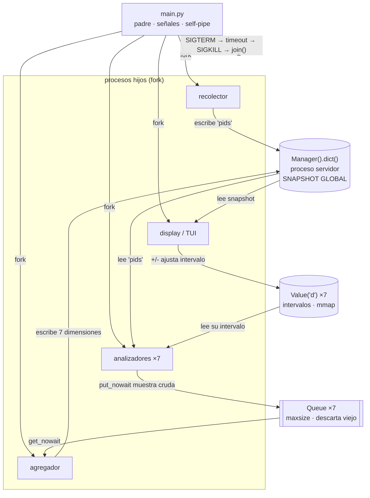

# Arquitectura del monitor

Documento de referencia: qué archivo hace qué, y cómo se comunican en runtime.

> Distinción importante para no confundirse leyendo esto:
> **importar un módulo no es comunicarse.** Los `import` son enlaces estáticos
> que existen antes de que arranque nada. La comunicación entre procesos ocurre
> en runtime, por primitivas de `multiprocessing`, y va por otros caminos.
> Por eso hay dos diagramas separados.

---

## 1. Árbol de archivos

```
monitor_linux_01/
├── config.json                 config inicial: intervalos, filtros default
├── Makefile                    atajos (make run / test / debug / clean)
├── Dockerfile
├── docker-compose.yml
├── requirements.txt
├── requirements-dev.txt
├── README.md                   informe (entregable evaluado)
├── dudas.md
├── docs/
│   └── ARQUITECTURA.md         este archivo
├── src/
│   ├── main.py                 ENTRY POINT — crea IPC, lanza procesos, señales
│   ├── config.py               carga/valida config.json (usado por SIGHUP)
│   ├── procfs.py               parseo puro de /proc — SIN concurrencia
│   ├── senales.py              handlers + self-pipe
│   ├── recolector.py           lista PIDs vivos y los publica
│   ├── agregador.py            consume muestras, calcula derivados, escribe snapshot
│   ├── display.py              TUI: render + teclado
│   └── analizadores/
│       ├── base.py             loop común de los 7 analizadores
│       ├── resumen.py          estado, CPU%, RSS, threads, comando
│       ├── memoria.py          Vm*, page faults, segmentos de maps
│       ├── fds.py              /proc/<pid>/fd/ y tipos
│       ├── threads.py          /proc/<pid>/task/<tid>/
│       ├── senales.py          máscaras SigBlk/Ign/Cgt/Pnd
│       ├── scheduling.py       nice, prio, policy, affinity, ctx switches
│       └── sistema.py          /proc/stat, meminfo, loadavg, uptime
└── tests/
    └── test_procfs.py          parseo con strings de muestra (sin tocar /proc)
```

> **Nota sobre desvíos de la estructura sugerida en la consigna.** La consigna
> lista `main.py`, `recolector.py`, `analizadores/*`, `display.py`, `procfs.py`
> y `senales.py`. Se agregan tres archivos:
>
> - `agregador.py` — porque el agregador es un componente obligatorio de la
>   consigna (tabla de "Componentes mínimos") y se decidió implementarlo como
>   proceso propio. Ver §3.4 del README.
> - `analizadores/base.py` — para no repetir 7 veces el mismo loop.
> - `config.py` — la consigna pide recargar `config.json` con SIGHUP.
>
> Hay una colisión de nombres a tener en cuenta: `src/senales.py` (handlers del
> monitor) y `src/analizadores/senales.py` (analizador de las máscaras de los
> procesos observados). Son cosas distintas y no se importan entre sí.

---

## 1.1 Qué hace cada módulo

Para cada uno: **qué hace**, **qué recibe**, **qué entrega** y —tan importante
como lo anterior— **qué NO hace**, que es lo que evita que las
responsabilidades se mezclen.

---

### `src/main.py` — entry point y padre de todos

| | |
|---|---|
| **Es un proceso** | Sí: el padre. Es el único que sobrevive a todo. |
| **Qué hace** | Carga la config, crea **todas** las primitivas de IPC, instala los handlers de señales, forkea los 10 hijos y después se queda dormido en un `select()` sobre el self-pipe esperando señales. Orquesta el shutdown. |
| **Recibe** | Argumentos de línea de comandos y `config.json`. |
| **Entrega** | Nada a nadie: reparte objetos IPC como argumentos del `Process(...)`. |
| **No hace** | **No lee `/proc`, no dibuja, no calcula nada.** Si `main.py` empieza a parsear algo, está mal ubicado. Su único trabajo es ciclo de vida. |

Es el único lugar donde se llama a `Manager()`, `Queue()` y `Value()`, y tiene
que ser **antes** del primer `fork()` para que los hijos los hereden.

---

### `src/config.py` — configuración

| | |
|---|---|
| **Es un proceso** | No. Módulo de funciones puras. |
| **Qué hace** | Lee y valida `config.json`: intervalos por vista, filtros default, tamaño de las colas, modo verbose. Aplica defaults si el archivo falta o tiene basura. |
| **Recibe** | Ruta del `config.json`. |
| **Entrega** | Un dict validado. |
| **No hace** | No guarda estado global mutable ni escribe el archivo. |

Existe por `SIGHUP`: la consigna pide **recargar la configuración en caliente**.
Cuando llega esa señal, el padre vuelve a llamar a `config.cargar()` y escribe
los nuevos intervalos en los `Value` compartidos — los analizadores los ven en
su siguiente vuelta, sin reiniciar nada.

---

### `src/procfs.py` — parseo de `/proc` *(ya implementado)*

| | |
|---|---|
| **Es un proceso** | No. Módulo de funciones puras, hoja del grafo de dependencias. |
| **Qué hace** | Abre archivos de `/proc`, los parsea y devuelve estructuras de Python. Concentra **todo** el manejo de errores del filesystem virtual. |
| **Recibe** | PIDs y TIDs. |
| **Entrega** | dicts y listas; **`None` cuando el proceso murió o no hay permisos**. |
| **No hace** | No sabe que existe `multiprocessing`, ni la TUI, ni los analizadores. No calcula porcentajes por proceso (eso necesita memoria entre lecturas, y este módulo no tiene estado). No cachea, salvo la tabla UID→usuario. |

Funciones principales: `listar_pids`, `listar_tids`, `leer_status`, `leer_stat`,
`leer_cmdline`, `listar_fds`, `leer_maps`, `agrupar_segmentos`,
`decodificar_mascara`, `leer_stat_global`, `leer_meminfo`, `leer_loadavg`,
`leer_uptime`, `usuario_de_uid`.

Es el único módulo que se puede testear sin levantar un proceso.

---

### `src/senales.py` — handlers del monitor

> Ojo: este archivo es sobre las señales que **recibe el monitor**. El analizador
> `analizadores/senales.py` es sobre las máscaras de los procesos **observados**.
> Son cosas distintas y no se importan entre sí.

| | |
|---|---|
| **Es un proceso** | No. Corre dentro del padre. |
| **Qué hace** | Crea el self-pipe (`os.pipe()` con las dos puntas en no-bloqueante), registra los handlers de SIGINT, SIGTERM, SIGHUP, SIGUSR1, SIGUSR2 y SIGWINCH, y expone la punta de lectura para que `main.py` la meta en un `select()`. |
| **Recibe** | Nada. |
| **Entrega** | El fd de lectura del self-pipe, y una función para traducir el byte recibido a "qué señal fue". |
| **No hace** | **Los handlers no hacen trabajo real.** Escriben un byte y vuelven. No tocan el snapshot, no matan hijos, no escriben archivos, no hacen `print`. |

Esa última línea es la razón de existir del módulo. Un handler interrumpe al
proceso en un punto arbitrario; si el código interrumpido tenía tomado un lock
interno (de una `Queue`, del allocator, de `print`) y el handler intenta usar lo
mismo, hay deadlock. `write()` a un pipe es *async-signal-safe*; casi nada más
lo es. El handler despierta al loop principal y el trabajo pesado se hace ahí,
fuera del contexto de señal.

También expone la utilidad para que **los hijos bloqueen `SIGINT`**
(`signal.pthread_sigmask`), de modo que Ctrl+C —que el kernel manda a todo el
grupo de procesos— no los mate por su cuenta y el padre pueda ordenar la salida.

---

### `src/recolector.py` — descubre qué procesos existen

| | |
|---|---|
| **Es un proceso** | Sí. Uno. |
| **Qué hace** | Cada ~1 s lista `/proc`, se queda con las carpetas numéricas y publica la lista de PIDs vivos en `snapshot["pids"]`. |
| **Recibe** | El `DictProxy` del snapshot y el `Event` de parada. |
| **Entrega** | `snapshot["pids"] = [ints]` + timestamp (canal 1). |
| **No hace** | **No lee el contenido de ningún `/proc/<pid>/`.** No sabe qué es el RSS ni el nice. Solo enumera. |

Corre a 1 s, más rápido que el analizador más rápido (2 s), para que ninguno
trabaje sobre una lista vieja. Es el componente más barato del sistema: un solo
`os.listdir()`.

Que esto sea un proceso aparte y no una función que cada analizador llama por su
cuenta tiene un motivo: **los 7 tienen que ver la misma lista de PIDs**. Si cada
uno listara `/proc` por separado, las 7 vistas mostrarían conjuntos ligeramente
distintos de procesos y no se podrían cruzar los datos.

---

### `src/analizadores/base.py` — el loop común

| | |
|---|---|
| **Es un proceso** | No por sí mismo: es el código que corre **cada uno** de los 7. |
| **Qué hace** | Implementa el ciclo: leer el intervalo del `Value` → leer `snapshot["pids"]` → llamar a la función `extraer(pid)` del analizador concreto → empaquetar la muestra → `put_nowait` en su cola descartando la más vieja si está llena → dormir de forma interrumpible. |
| **Recibe** | `nombre`, la función `extraer`, el snapshot, su `Queue`, su `Value` de intervalo, el `Event` de parada. |
| **Entrega** | `{"dimension", "ts", "datos": {pid: ...}}` en la cola (canal 3). |
| **No hace** | No parsea `/proc` (eso es `procfs`) ni escribe al snapshot (eso es el agregador). |

Existe para no repetir 7 veces el mismo loop con los mismos tres bugs sutiles
(releer el intervalo en cada vuelta, dormir interrumpible, descartar el viejo).

---

### Los 7 analizadores

Todos tienen la misma forma: exponen una función `extraer(pid)` que devuelve el
dict de esa dimensión para ese PID, o `None` si el proceso murió. **Ninguno
escribe al snapshot ni conoce a los demás.** Corren en paralelo, cada uno en su
proceso y con su propio ritmo.

| Archivo | Default | Lee de `/proc` | Extrae |
|---|---|---|---|
| `resumen.py` | 2 s | `stat`, `status`, `cmdline` | PID, PPID, UID/usuario, estado R/S/D/T/Z, comando, threads, jiffies crudos para el CPU% |
| `memoria.py` | 3 s | `status`, `stat`, `maps` | VmSize, VmRSS, VmData, VmStk, VmExe, VmLib, VmHWM, VmSwap, page faults minor/major, segmentos agrupados |
| `fds.py` | 5 s | `fd/` (listdir + readlink) | lista de FDs, destino y tipo (tty/socket/pipe/file/anon) |
| `threads.py` | 2 s | `task/<tid>/{stat,status,comm}` | un registro por LWP: TID, nombre, estado, jiffies, context switches |
| `senales.py` | 10 s | `status` | SigBlk, SigIgn, SigCgt, SigPnd, ShdPnd decodificadas a nombres |
| `scheduling.py` | 10 s | `stat`, `status` | nice, priority, policy, RT priority, affinity, ctx switches vol/invol, utime/stime, SID, PGID |
| `sistema.py` | 2 s | `/proc/stat`, `meminfo`, `loadavg`, `uptime` | CPU global crudo, memoria, load, boot time, uptime |

Dos notas sobre esta tabla:

- **`resumen.py` entrega jiffies crudos, no el CPU%.** El porcentaje necesita
  dos lecturas y el analizador no guarda la anterior. Lo calcula el agregador.
- **`sistema.py` es el único que no itera sobre PIDs.** Lee 4 archivos fijos, así
  que su costo no crece con la cantidad de procesos.

---

### `src/agregador.py` — el que tiene memoria

| | |
|---|---|
| **Es un proceso** | Sí. Uno. |
| **Qué hace** | Consume las 7 colas, guarda en **memoria propia** la muestra anterior de cada dimensión, calcula todo lo que requiere comparar dos instantes, y escribe el resultado al snapshot. |
| **Recibe** | Las 7 `Queue` y el `DictProxy`. |
| **Entrega** | Las 7 dimensiones del snapshot, ya listas para dibujar (canal 4). |
| **No hace** | No lee `/proc` ni renderiza. |

Lo que calcula, y que **nadie más puede calcular**:

- **CPU% por proceso**: `(utime₂+stime₂ − utime₁−stime₁) / HZ / Δt × 100`
- **CPU% global**: mismo delta sobre las columnas de `/proc/stat`
- **CPU% por thread**: ídem sobre cada TID
- Top 3 por CPU y por memoria
- Totales del sistema: procesos por estado, threads totales, **conteo de zombies**
- Detección de PIDs que desaparecieron, para descartar su estado anterior

Es la respuesta concreta a "¿por qué el agregador no puede ser simplemente el
proceso servidor del `Manager`?": **el `Manager` no recuerda nada, solo guarda el
último valor escrito.** Alguien tiene que sostener `utime₁` en memoria privada, y
ese alguien es este proceso.

Consecuencia de diseño: **el agregador es el único punto de escritura del
snapshot** (salvo `"pids"`). Eso elimina por construcción cualquier race entre
escritores.

---

### `src/display.py` — la TUI

| | |
|---|---|
| **Es un proceso** | Sí. Uno. Con un thread interno para el teclado. |
| **Qué hace** | Dibuja ~4 veces por segundo: lista de procesos arriba, panel de detalle abajo según la vista activa. Maneja las 7 vistas, la navegación, el pin, los filtros por comando y usuario, el ordenamiento y el ajuste de intervalos. |
| **Recibe** | El `DictProxy` (lectura) y los 7 `Value` de intervalo (escritura). |
| **Entrega** | Píxeles en la terminal, y el intervalo nuevo al `Value` cuando apretás `+`/`-` (canal 6). |
| **No hace** | **No lee `/proc` jamás.** Si el snapshot está vacío o viejo, dibuja lo que hay y muestra la antigüedad. |

Estado que vive solo acá (no se comparte con nadie): vista activa, fila
seleccionada, PID pineado, texto del filtro, criterio de orden.

**Por qué un thread para el teclado y no otro proceso.** Es la única excepción a
la regla multiproceso, y la consigna la autoriza explícitamente. La razón: leer
una tecla es una syscall bloqueante —**suelta el GIL**— y el thread necesita
compartir el estado de la UI con el que dibuja. Es exactamente el caso donde los
threads sirven: I/O-bound y con memoria compartida.

**Cómo detecta datos viejos.** Cada dimensión del snapshot lleva su timestamp. Si
`now - ts > 3 × intervalo`, el panel se marca como *stale*. Eso es lo que hace
visible que un analizador se murió: sin el timestamp, el display mostraría los
últimos datos congelados como si fueran frescos.

---

### `tests/test_procfs.py`

| | |
|---|---|
| **Qué hace** | Testea el parseo con **strings de muestra**, no contra `/proc` real. |
| **Por qué** | `/proc` cambia entre ejecuciones: no se puede escribir un test determinista contra él. Con un string fijo sí. |
| **Casos que importan** | `comm` con espacios y paréntesis; `cmdline` vacío (kernel thread); proceso inexistente → `None`; decodificación de máscaras contra un valor conocido; línea de `maps` con ruta que contiene espacios. |

---

### Tabla resumen

| Archivo | ¿Proceso? | Lee `/proc` | Escribe snapshot | Tiene estado propio |
|---|---|---|---|---|
| `main.py` | sí (padre) | no | no | config, lista de hijos |
| `config.py` | no | no | no | no |
| `procfs.py` | no | **sí** (único) | no | solo cache UID→user |
| `senales.py` | no | no | no | el self-pipe |
| `recolector.py` | sí | sí (`listdir`) | sí (`"pids"`) | no |
| `analizadores/base.py` | ×7 | vía `procfs` | no | no |
| `analizadores/*.py` | — | vía `procfs` | no | no |
| `agregador.py` | sí | no | **sí** (7 dims) | **sí: muestra anterior** |
| `display.py` | sí | no | no | vista, selección, filtros |

Las dos columnas que más ordenan el diseño son las dos últimas: **solo el
agregador escribe el snapshot** (salvo `"pids"`), y **solo el agregador guarda
estado entre iteraciones**.

---

## 2. Diagrama estático: quién importa a quién

```
                            ┌──────────────┐
                            │   main.py    │  entry point
                            └──────┬───────┘
             ┌─────────────┬───────┼────────┬──────────────┐
             │             │       │        │              │
       ┌─────▼─────┐ ┌─────▼────┐  │  ┌─────▼──────┐ ┌─────▼──────┐
       │senales.py │ │config.py │  │  │recolector  │ │agregador.py│
       │(handlers) │ │          │  │  │   .py      │ │            │
       └───────────┘ └────▲─────┘  │  └─────┬──────┘ └─────┬──────┘
                          │        │        │              │
                          │  ┌─────▼──────┐ │              │
                          └──┤ display.py │ │              │
                             └─────┬──────┘ │              │
                                   │        │              │
                    ┌──────────────┘        │              │
                    │   ┌───────────────────┘              │
                    │   │   ┌──────────────────────────────┘
                    │   │   │
              ┌─────▼───▼───▼──────────┐
              │  analizadores/base.py  │
              └───────────┬────────────┘
                          │  (los 7 heredan/usan base)
        ┌────────┬────────┼────────┬────────┬─────────┬─────────┐
        │        │        │        │        │         │         │
    resumen  memoria    fds    threads   senales  scheduling  sistema
        │        │        │        │        │         │         │
        └────────┴────────┴────────┴───┬────┴─────────┴─────────┘
                                       │
                              ┌────────▼─────────┐
                              │    procfs.py     │  ← hoja del grafo
                              │  (no importa     │    no depende de nada
                              │   nada del TP)   │    del proyecto
                              └──────────────────┘
```

**La propiedad importante de este grafo: `procfs.py` es una hoja.** No importa
ningún módulo del proyecto, no sabe que existe `multiprocessing`, y no tiene
estado global mutable. Por eso se puede testear con strings de muestra sin
levantar un solo proceso, y por eso el resto del sistema no repite manejo de
errores de `/proc`.

---

## 3. Diagrama de runtime: procesos y canales de IPC

```
 ╔═══════════════════════════════════════════════════════════════════════════╗
 ║  PROCESO PADRE — main.py                                    PID = N        ║
 ║                                                                            ║
 ║  · crea Manager(), Queues y Values ANTES de forkear                        ║
 ║  · instala handlers (SIGINT/TERM/HUP/USR1/USR2) + self-pipe                ║
 ║  · lanza los 10 hijos y después solo espera en el self-pipe                ║
 ║  · orquesta el shutdown: SIGTERM -> timeout -> SIGKILL -> join()           ║
 ╚═════╤══════════════════════════════════════════════════════════════════════╝
       │ fork()  (los hijos heredan el PGID -> Ctrl+C les llega a todos)
       │         (cada hijo bloquea SIGINT: solo el padre decide cuándo morir)
       │
  ┌────┴─────┬────────────────┬─────────────────┬──────────────┐
  │          │                │                 │              │
  ▼          ▼                ▼                 ▼              ▼
┌──────────┐ ┌────────────────────────────┐ ┌───────────┐ ┌──────────┐
│RECOLECTOR│ │  ANALIZADORES  (×7)        │ │ AGREGADOR │ │ DISPLAY  │
│          │ │  resumen  memoria  fds     │ │           │ │  (TUI)   │
│ lista    │ │  threads  senales          │ │ calcula   │ │          │
│ /proc    │ │  scheduling  sistema       │ │ derivados │ │ render + │
│ cada 1s  │ │                            │ │           │ │ teclado  │
└────┬─────┘ └──┬──────────────────┬──────┘ └──┬─────┬──┘ └──┬────┬──┘
     │          │                  │           │     │       │    │
     │(1)       │(2)               │(3)        │(3)  │(4)    │(5) │(6)
     │escribe   │lee               │put_nowait │get  │escribe│lee │escribe
     │"pids"    │"pids"            │           │     │dims   │snap│intervalo
     │          │                  │           │     │       │    │
     │          │            ┌─────▼───────────▼──┐  │       │    │
     │          │            │ Queue(maxsize=4) ×7│  │       │    │
     │          │            │  muestras crudas   │  │       │    │
     │          │            │  descarta el viejo │  │       │    │
     │          │            └────────────────────┘  │       │    │
     │          │                                    │       │    │
     ▼          ▼                                    ▼       ▼    │
 ╔═══════════════════════════════════════════════════════════╗    │
 ║  Manager().dict()   — vive en su PROPIO proceso servidor  ║    │
 ║  (lo crea Manager() por su cuenta, no lo lanzamos noso-   ║    │
 ║   tros; verificable con `ps --ppid <pid del padre>`)      ║    │
 ║                                                            ║    │
 ║   "pids"       : [1, 2, 42, ...]              ts: ...     ║    │
 ║   "resumen"    : {pid: {...}}                 ts: ...     ║    │
 ║   "memoria"    : {pid: {...}}                 ts: ...     ║    │
 ║   "fds"        : {pid: [...]}                 ts: ...     ║    │
 ║   "threads"    : {pid: [...]}                 ts: ...     ║    │
 ║   "senales"    : {pid: {...}}                 ts: ...     ║    │
 ║   "scheduling" : {pid: {...}}                 ts: ...     ║    │
 ║   "sistema"    : {cpu, mem, load, totales}    ts: ...     ║    │
 ╚═══════════════════════════════════════════════════════════╝    │
                                                                  │
 ┌────────────────────────────────────────────────────────────────┘
 │
 ▼
╔══════════════════════════════════════════════════════════════╗
║  Array de Value('d') × 7  — intervalos por analizador        ║
║  memoria compartida real (mmap), sin pickle ni socket        ║
║  [2.0, 3.0, 5.0, 2.0, 10.0, 10.0, 2.0]                       ║
║   res  mem  fds  thr  sen   sch   sis                        ║
╚══════════════════════════════════════════════════════════════╝
```

### Versión mermaid



---

## 4. Tabla de canales

| # | Origen | Destino | Primitiva | Contenido | Sentido |
|---|---|---|---|---|---|
| 1 | recolector | snapshot | `Manager().dict()` | `"pids": [int]` | escribe |
| 2 | snapshot | analizadores ×7 | `Manager().dict()` | `"pids"` | leen |
| 3 | analizadores ×7 | agregador | `Queue` ×7 | muestra cruda + timestamp | `put_nowait` / `get_nowait` |
| 4 | agregador | snapshot | `Manager().dict()` | 7 dimensiones + ts | escribe |
| 5 | snapshot | display | `Manager().dict()` | todo | lee |
| 6 | display | analizadores ×7 | `Value('d')` ×7 | intervalo en segundos | escribe / leen |
| 7 | kernel | padre | señales + self-pipe | SIGINT/TERM/HUP/USR1/USR2 | recibe |
| 8 | padre | hijos | `SIGTERM` → `SIGKILL` | orden de shutdown | envía |

**Por qué cada elección está en el README §3.2.** Resumen del criterio:
*mensaje* (se consume una vez) → `Queue`; *estado* (se lee N veces) → `Manager`;
*estado chico y de tipo simple* → `Value`.

---

## 5. Secuencia de arranque

El orden importa: **todas las primitivas de IPC se crean ANTES del primer
`fork()`**, para que los hijos las hereden por copia del espacio de direcciones.
Si se crearan después, el hijo no las tendría.

```
main.py
  1. config.cargar("config.json")
  2. mgr = Manager()                 ← levanta el proceso servidor
     snapshot = mgr.dict()
  3. colas     = [Queue(maxsize=4) for _ in range(7)]
  4. intervalos = [Value('d', x) for x in config.intervalos]
  5. parar = Event()                 ← flag de shutdown compartido
  6. senales.instalar_handlers()     ← self-pipe + signal.signal()
  7. Process(recolector, args=(snapshot, parar)).start()
     for i in range(7):
         Process(analizador_i, args=(snapshot, colas[i], intervalos[i], parar)).start()
     Process(agregador, args=(snapshot, colas, parar)).start()
     Process(display,   args=(snapshot, intervalos, parar)).start()
  8. loop: select() sobre el self-pipe → despachar la señal recibida
```

**Sobre `fork` vs `spawn`.** Se usa el default de Linux, `fork`, por dos
razones: (a) es lo que permite que los hijos hereden los objetos ya creados sin
tener que pickearlos, y (b) es más barato gracias a Copy-on-Write — el espacio
de memoria no se copia, se marca read-only y solo se duplican las páginas que
alguien escribe. Con `spawn` habría que reimportar todo y pasar cada objeto por
pickle, y no todos los objetos son pickleables.

Contrapartida de `fork` a tener presente: el hijo hereda **todo**, incluyendo
locks que podrían haber quedado tomados por un thread que no existe en el hijo.
Por eso los hijos se lanzan temprano, antes de levantar threads en el padre.

---

## 6. Secuencia de shutdown

```
        Ctrl+C
          │
          ▼
   kernel manda SIGINT al GRUPO DE PROCESOS en foreground
          │
          ├──────────────► hijos: SIGINT BLOQUEADA (queda pendiente,
          │                       no la actúan, siguen su loop)
          │
          ▼
   padre: handler async-signal-safe
          escribe UN byte en el self-pipe  ← lo único que hace
          │
          ▼
   loop principal despierta del select()
          1. parar.set()                    ← aviso cooperativo
          2. espera hasta 2 s a que los hijos salgan solos
          3. a los que quedan: proc.terminate()   (SIGTERM)
          4. espera 1 s más
          5. a los que quedan: proc.kill()        (SIGKILL, último recurso)
          6. proc.join()  ← OBLIGATORIO: sin esto quedan ZOMBIES
          7. mgr.shutdown()
          8. persiste log / dump si corresponde
```

**Por qué el handler solo escribe un byte (patrón self-pipe).** Un handler de
señal interrumpe al proceso en un punto arbitrario del código. Si el proceso
estaba a mitad de un `put()` en una `Queue` —con el lock interno tomado— y el
handler intenta otro `put()`, se produce un deadlock consigo mismo. Solo unas
pocas operaciones son *async-signal-safe*; `write()` sobre un pipe es una de
ellas. Por eso el handler no hace trabajo: solo despierta al loop principal,
que hace el trabajo real fuera del contexto de señal.

**Por qué el `join()` del paso 6 no es opcional.** Un hijo que terminó pero
cuyo padre no llamó a `wait()` queda en estado `Z` (zombie): el kernel conserva
su entrada en la tabla de procesos para que el padre pueda leer su código de
salida. `join()` es el `wait()` de `multiprocessing`. Si se omite, el monitor
va a mostrar sus propios 10 analizadores en estado `Z` en la vista Sistema.

### Otras señales

| Señal | Handler escribe en self-pipe | El loop principal hace |
|---|---|---|
| `SIGINT` / `SIGTERM` | byte `b'T'` | secuencia de shutdown de arriba |
| `SIGHUP` | byte `b'H'` | `config.cargar()` y actualizar los `Value` de intervalos |
| `SIGUSR1` | byte `b'1'` | volcar `dict(snapshot)` a `dump_<ts>.json` |
| `SIGUSR2` | byte `b'2'` | togglear verbose en un `Value('b')` compartido |
| `SIGWINCH` | byte `b'W'` | reenviar al display para que repinte |

---

## 7. Loop de un analizador

Los 7 comparten esta estructura (`analizadores/base.py`); lo único que cambia
es la función `extraer(pid)` de cada uno.

```python
def correr(nombre, extraer, snapshot, cola, intervalo, parar):
    while not parar.is_set():
        t0 = time.monotonic()

        pids = snapshot.get("pids", [])          # canal 2
        muestra = {}
        for pid in pids:
            dato = extraer(pid)                  # procfs.*  → None si murió
            if dato is not None:
                muestra[pid] = dato

        enviar_descartando_viejo(cola, {         # canal 3
            "dimension": nombre,
            "ts": time.time(),
            "datos": muestra,
        })

        # canal 6: se relee en CADA vuelta, por eso +/- tiene efecto inmediato
        with intervalo.get_lock():
            espera = intervalo.value
        dormir_interrumpible(parar, espera - (time.monotonic() - t0))
```

Tres detalles que no son decorativos:

- **El intervalo se relee en cada vuelta.** Si se leyera una sola vez antes del
  loop, apretar `+` no haría nada hasta reiniciar.
- **`intervalo.get_lock()`** — `Value` trae un lock propio. En un `double` de
  8 bytes la lectura probablemente sea atómica en x86-64, pero eso es una
  garantía de la arquitectura, no del lenguaje. El lock lo hace correcto en
  cualquier plataforma.
- **`dormir_interrumpible`** en vez de `time.sleep(10)`. Con un sleep pelado,
  el analizador de señales tardaría hasta 10 segundos en enterarse de que hay
  que parar. Se usa `parar.wait(timeout=...)`, que devuelve apenas se setea.

---

## 8. Puntos de race condition identificados

| Dónde | Riesgo | Mitigación |
|---|---|---|
| `Value` de intervalo: display escribe, analizador lee | lectura a medio escribir | `with intervalo.get_lock():` de los dos lados |
| Patrón descartar-el-viejo (`get_nowait` + `put_nowait`) | dos productores podrían sacar dos y meter dos | **una `Queue` por analizador** → un solo escritor por cola, el problema desaparece por diseño |
| `snapshot["pids"]` mientras el recolector lo reescribe | lectura de lista parcial | el `DictProxy` serializa cada operación en el proceso servidor; se reasigna la clave entera (`snapshot["pids"] = nueva`), nunca se muta in-place |
| `snapshot[dim] = {...}` con dict anidado | modificar un dict anidado **no** se propaga | se reasigna siempre la clave de primer nivel; nunca `snapshot["resumen"][pid] = x` |
| Proceso que muere entre dos lecturas de `/proc` | datos inconsistentes | `procfs.*` devuelve `None`; el analizador descarta ese PID |

> El cuarto es el más traicionero y no da error: `snapshot["resumen"][pid] = x`
> modifica una **copia local** del dict anidado y la descarta. Solo el primer
> nivel es un proxy.

---

## 9. Frecuencias

| Componente | Intervalo default | Por qué |
|---|---|---|
| recolector | 1 s | tiene que ir más rápido que el analizador más rápido, o los analizadores trabajan sobre una lista de PIDs vieja |
| resumen | 2 s | vista principal, hay que ver los cambios de CPU |
| memoria | 3 s | `maps` es caro: cientos de líneas por proceso |
| fds | 5 s | requiere un `readlink()` por FD, muchas syscalls |
| threads | 2 s | vista principal de la clase 10 |
| señales | 10 s | las máscaras casi nunca cambian |
| scheduling | 10 s | nice/policy casi nunca cambian |
| sistema | 2 s | barato: 4 archivos en total, no depende de la cantidad de procesos |
| agregador | continuo | bloqueado esperando en las colas |
| display | ~4 fps | independiente de los analizadores: dibuja lo último que haya |
```
